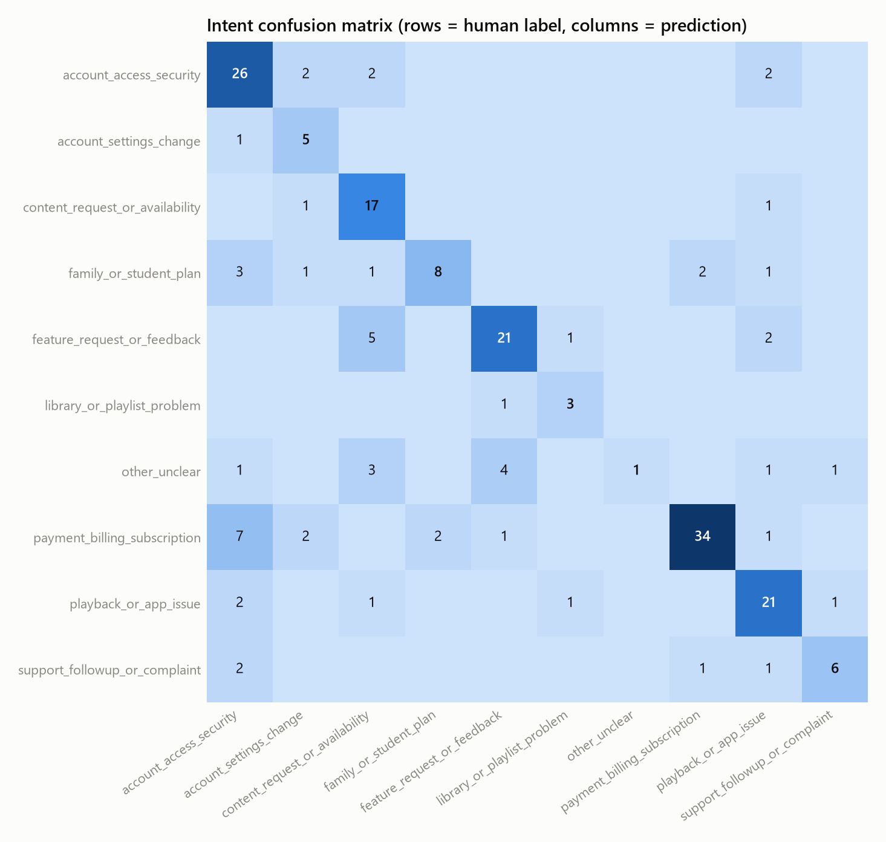
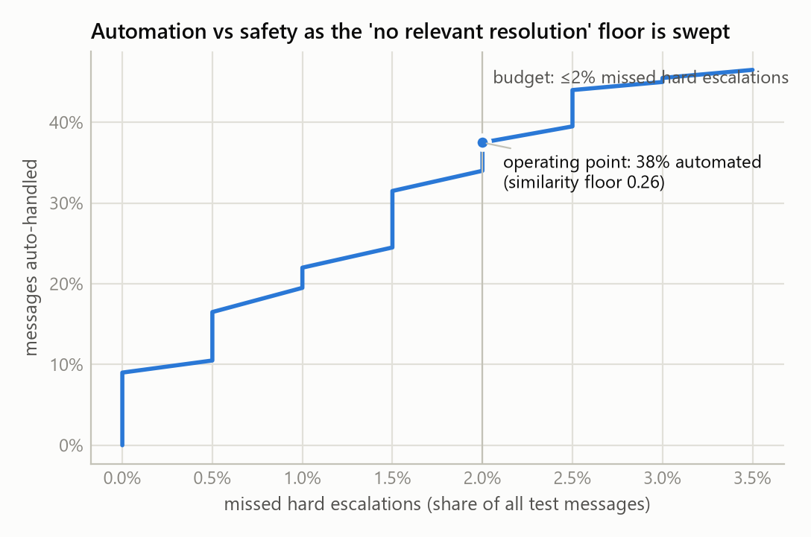
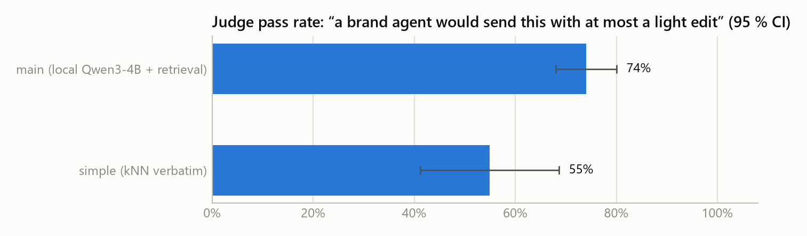

# An AI support agent for SpotifyCares: what it does, how well, and why the headline number is not the whole story

*Hiver SDE Intern take-home — report (≤ 6 pages). Source of truth is this file; `report/report.docx` is rendered from it. Code: github.com/Devesh-Ingale/hiver-support-agent.*

## 1. Problem framing: what "good" means for SpotifyCares

SpotifyCares answers customers in public, one tweet at a time, and the first reply is a triage decision: give a troubleshooting step, ask the one clarifying question that unblocks the case, or move the person to DM because the fix needs their account. A *good* first public reply therefore (a) engages with the specific problem, (b) says only things the brand has actually said in comparable cases, (c) is short and concrete — one next step, ≤280 characters, no handles or agent initials — and (d) never asks for sensitive data in public or promises refunds, fixes or dates. The *good decision* is to auto-send such a reply when history contains the answer and to escalate whenever the account, money, law/safety or an explicit request for a human is involved.

That framing was written down as a policy (`taxonomy.yaml`) **before** any label or model output existed, and it drives three things at once: the human labels, the deterministic rules the agent obeys, and the judge's rubric. It also fixed the acceptance gate the system must clear to be "good enough to trust" (§9): hard-category escalation recall ≥ 0.95 (lower 95 % CI ≥ 0.85), zero validity violations on auto-sent drafts, judge pass-rate ≥ 70 % on auto-handled drafts, expected cost below always-escalating, and a stated automation rate at ≤ 2 % missed hard escalations.

### What I chose not to build

Multi-turn handling (the agent sees only the first customer tweet), DMs and account look-ups, actually sending replies, fine-tuning, sentence-embedding retrieval, other brands, Banking77 (77 banking intents do not transfer to a music app's Twitter traffic), and any UI. Each is either out of scope for a first-reply triage system or would have consumed the time the proof needed.

## 2. Data and brand selection

The Kaggle *Customer Support on Twitter* dump (2.81 M tweets, Oct–Dec 2017) was rebuilt into 798 k threads by following `in_response_to_tweet_id`; 149 tweets sit in reply cycles and were left at their current ancestor. Every customer-rooted thread in the dump has a brand reply — the dump was collected *from* brand accounts — so "the brand replied" is a property of the data, not a finding, and the golden set inherits that selection.

Two dataset quirks mattered. The dump anonymises every non-support handle as `@<number>`, **including the brand's own marketing account**: 45 % of SpotifyCares' inbound tweets address `@115888`, which is @Spotify, not another customer. Ids mentioned in ≥ 10 % of a brand's roots are therefore treated as brand aliases. And agents sign public replies with initials (`/JR`), a convention that a small model copies verbatim unless it is stripped from the evidence (§7).

The brand was chosen from a profile of the 15 largest accounts (Fig. 1): enough history, a real mix of public help and private hand-offs (so the auto/escalate boundary can be learned from the brand, not only from my policy), and a product narrow enough for ≤ 10 intents. SpotifyCares: 28.2 k customer threads (20.9 k before the cutoff, 6.4 k in the 14-day golden window), 40 % of threads receive substantive help, brand turns are 8.5 % steps / 25 % links / 31 % DM-redirects / 18 % clarifying questions, 92 % English. AppleSupport has more data but 53 % of its turns are the same "let's take this to DM" template; hulu_support is the most substantive but small and almost never hands off, so escalation labels would rest on my policy alone.


*Fig. 1 — Substance vs boilerplate in the first public reply, 15 largest brands.*

**Split.** Everything the system may learn from (retrieval corpus, taxonomy induction) is strictly before 2017-11-17; golden candidates come from the following 14 days, with a 2-day buffer before the dump's tail where threads are truncated. No golden thread is in the index (asserted, not assumed).

## 3. Intent taxonomy and escalation policy

Ten intents were written by hand from 20 TF-IDF clusters over 3,000 pre-cutoff tweets (a local-model proposal was used as a cross-check and was too granular): `playback_or_app_issue`, `library_or_playlist_problem`, `account_access_security`, `account_settings_change`, `payment_billing_subscription`, `family_or_student_plan`, `content_request_or_availability`, `feature_request_or_feedback`, `support_followup_or_complaint`, `other_unclear`. Each carries a definition, examples and tie-breaker rules (security beats billing; "greyed out" is playback, "not on Spotify" is availability; praise for staff is a support follow-up, praise for the product is feedback).

Escalation reasons are tiered. **Hard** (always): `account_or_pii`, `payment_refund`, `legal_safety_threat`, `explicit_human_request` — each backed by regexes that fire on 16 % of golden candidates. **Soft**: `anger_churn`. **Routing**: `non_english`, `no_actionable_content`, `no_relevant_resolution`, `draft_invalid`. The taxonomy was frozen as v1 after a 30-item labelling pilot (merges and clarifications only) and committed; the hash is quoted in §5.

## 4. System

One structured call per tweet, wrapped in deterministic code (Fig. 2). TF-IDF retrieval (word 1–2-grams + character 3–5-grams, cosine) returns the five most similar historical customer messages with everything the brand said in reply, down-weighting threads where the brand never gave a step or a link. A local **Qwen3-4B-Instruct** (Ollama, JSON-schema-constrained output, temperature 0) returns intent, secondary intent, confidence, the evidence ids it relied on, a draft reply, a reason and a decision. A post-processor then applies the policy: hard-rule regexes on the customer's text, language and empty-content routing, a "no relevant resolution" similarity floor (kept at 0 after the dev sweep — see §5 — and reported as a curve), tweet-validity checks (≤ 280 chars, no URL absent from the evidence, no `@handles`, no agent initials, no refund/timeline promises, no public request for sensitive data, no claim that something "has already been done"), and one rule that turned out to matter most: **a draft that hands the customer to DM is an escalation**, whatever the model called it — under this policy the hand-off *is* the point where a human takes over. The model can only be made *more* cautious by this layer; an invalid draft is never sent. Self-reported confidence gates nothing.

```
tweet → TF-IDF retrieval (k=5, boilerplate down-weighted) → one JSON call (local 4B model)
      → policy layer: hard rules · routing · similarity floor · validity checks → record (model answer + final answer)
```
*Fig. 2 — The pipeline. Every run row keeps both the model's answer and the policy-applied one, so all numbers are recomputable offline.*

Systems compared on the same 200 test items: **trivial** (majority intent, template reply, always-escalate and always-auto variants), **simple** (TF-IDF + logistic-regression intents by stratified 5-fold cross-validation with dev labels in every training fold; the brand's real reply to the nearest historical message, verbatim; the policy's keyword rules), **no_rag** (same prompt, no evidence), **main**, and **human_ref** (the brand's actual first replies, judged with the same rubric). A "same prompts on a hosted model" row was planned; the free tier allows 20 requests/day of every current Gemini Flash model, so it was {GEMINI_ROW_STATUS}.

## 5. Evaluation design

**Golden set.** 200 test items = Part A (120, uniform random from the eligible pool; small quotas of 6 near-empty and 6 non-English tweets so routing is exercised) + Part B (80, two per topic cluster plus an oversample of escalation-keyword tweets) — headline numbers use Part A, per-intent and escalation-recall tables use A+B and say so. A disjoint 50-item dev set is the only place prompts and thresholds were tuned; every dev round is logged. Sampling and every exclusion are recorded in `data/golden/sampling_note.md`. Labels: primary and optional secondary intent, escalate + reason code, anger 0–2, quality flags. **41 items were labelled by me, blind** (no model output, cluster id or brand reply visible) as the pilot that froze the taxonomy. **The other 209 were labelled by the AI assistant that built the pipeline**: two proposer models that are not the system under test suggested a label, the assistant accepted agreements and adjudicated disagreements against the frozen checklist (DECISIONS.md #21). I chose this because my labelling time could not be spent; the price is that the answer key is an AI's reading of my taxonomy, and §8 treats that as the headline's biggest caveat. 40 items were re-labelled blind by me on a later day, which on this set measures my agreement with the AI-made key. Taxonomy/policy commit: `51f0617`; golden-set commit (before any test prediction existed): `32f7239`. Taxonomy/policy commit: ``51f0617``.

**Dev iteration (the only tuning).** Four rounds on the 50 dev items, all logged in DECISIONS.md, none touching test: (1) 24/50 drafts had copied agents' sign-off initials from the evidence — initials are now stripped from evidence; (2) one draft copied the evidence's turn separator — turns are rendered numbered; (3) the first run against dev *labels* showed 78 % intent accuracy but only 10/15 must-escalate tweets escalated — three prompt sentences (a DM hand-off is `escalate`; pricing questions are `auto`; never claim an action was taken) and regex refinements ("dm me back", premium+ads; `charged` only in money contexts) took that to 11/15; (3b) the four remaining misses all had the model drafting a DM hand-off and calling it `auto`, so the hand-off rule above was added — dev hard recall 15/15, escalation F1 0.61→0.79, expected cost per 100 messages 102→28, automation 60 %, intent accuracy unchanged at 76 %. The similarity floor was swept on dev and does not buy safety cheaply (≤ 2 % missed-hard needed a floor that left 6 % automation before the rule, 42 % after round 3), so it stays at 0.

**Metrics.** Intent accuracy (headline) and macro-F1 with per-class support, strict and lenient (secondary counts). Escalation precision/recall/F1, **hard-category recall**, recall excluding trivially detectable classes, reason-code agreement, a cost view (missed hard = 10, missed soft = 3, unnecessary = 1 per item; sensitivity from 1× to 20×) and the automation rate at ≤ 2 % missed hard escalations, obtained by sweeping the similarity floor offline. Validity-violation rates of raw drafts. Bootstrap 95 % intervals on everything; paired bootstrap and McNemar for main vs each baseline; differences inside the interval are not claims. Run-to-run variance from a second seed on 50 items.

**Judge.** `gemini-3.5-flash-lite` (the strongest Gemini model with a usable free quota: 500 requests/day versus 20 for every other Flash) — a different model family from the generator, which removes self-preference by construction — sees the tweet, the same five historical cases for every system, the policy summary and the draft, never the label or the system name. It returns a rationale first, then five binary checks (unsupported content, addresses the problem, unsafe/over-promising, tweet-valid, decision-reason consistent), an overall 1–5 and **sendable** ("a brand agent would send this with at most a light edit"). Pairwise: main vs the verbatim-retrieval baseline in *both* orders; a verdict that flips with position counts as the judge's own noise. Judge validity is probed three ways: 12 synthetic good/bad replies (fabricated URL, public password request, promise, wrong product, off-topic, over-length), a perturbation test that injects one confident fabricated step into 20 good drafts, and a paraphrased-prompt re-judge of 50 items.

**Human agreement.** Before seeing any judge output, the author rated 80 blinded pairs (main vs simple, random A/B) and 40 blinded absolute replies stratified across four systems with the judge's own rubric. Reported: pairwise agreement and κ, sendable κ with CI, Spearman and weighted κ on the 1–5 score, agreement per system, and the disagreements themselves. The judge was **not** tuned against these ratings.

## 6. Results

All numbers are on the 200 frozen test items (Part A = 120 uniform random; Part B = 80 targeted); 95 % bootstrap intervals in brackets; every figure and table is recomputed by `python -m support_agent.cli eval` from committed outputs. The test set was evaluated once, after the configuration was frozen (touch log in DECISIONS.md).

| system | intent acc. | macro-F1 | hard-escalation recall | escalation P / R | automation | cost / 100 msgs | judge pass | pass on auto-sent |
|---|---|---|---|---|---|---|---|---|
| trivial (always escalate) | 13.0 % | 0.02 | 100 % | 0.52 / 1.00 | 0 % | 48 | {PASS_TRIVIAL} | — |
| trivial (always auto) | 13.0 % | 0.02 | 0 % | — / 0.00 | 100 % | 466 | — | — |
| simple (TF-IDF+LR · kNN reply · rules) | 55.5 % [48, 62] | 0.40 | 64.0 % [54, 74] | — / 0.65 | 58.0 % | 174 | {PASS_SIMPLE} | {PASS_SIMPLE_AUTO} |
| no_rag (same prompt, no evidence) | 76.0 % [70, 82] | 0.72 | 95.5 % [91, 99] | — / 0.93 | 33.5 % | 43 | {PASS_NORAG} | — |
| **main** (local Qwen3-4B + retrieval + rules) | **71.0 % [65, 77]** | **0.64** | **92.1 % [87, 97]** | **0.86 / 0.89** | **46.5 % [40, 54]** | **48** | **74.0 % [68, 80]** | **89.2 % [83, 96]** (n = 93) |
| main prompts on gemini-3.1-flash-lite | 91.0 % [87, 95] | 0.90 | 96.6 % [92, 100] | — / 0.95 | 41.5 % | 28 | — | — |
| brand's real first replies | — | — | — | — | — | — | {PASS_HUMAN_REF} | — |

**Intent.** `main` beats the simple baseline by +15.5 pp [7.5, 23.5] (McNemar p = 0.0005) and the trivial one by +58 pp, but is 5 pp *below* its own no-retrieval ablation (−5.0 [−10.0, 0.0], p = 0.09) and 20 pp below the same prompts on a small hosted Gemini model. On Part A alone `main` is 69.2 % [61, 77]. Per class it is strong on payment (F1 0.81), feature feedback and playback (0.75), content (0.71) and account access (0.70); weak on family/student (0.62, n = 16), account settings (0.59, n = 6) and near-useless on `other_unclear` (0.17): noise almost always receives a real intent (Fig. 3). The confusion that matters most is payment → account access (7 items).

**Escalation.** The model on its own escalates 34 % of messages; the deterministic layer raises that to 53.5 % (79 forced decisions: payment regex 28, drafted-DM-hand-off rule 18, account regex 13, empty/non-English 12, invalid draft 6, legal 1, explicit human 1). Hard recall 92.1 % (7 of 89 hard items missed; 3.5 % of all messages); 91.3 % once the trivially detectable classes are removed. When both the key and the system escalate, the reason code matches exactly 66 % of the time and at the hard/soft/routing tier 92 %. Under the 10 : 3 : 1 cost matrix `main` costs 48 per 100 messages — the same as escalating everything — because seven missed hard cases at cost 10 cancel the 93 messages it handles automatically. Sweeping the similarity floor offline (Fig. 4) gives **37.5 % automation at ≤ 2 % missed hard escalations** (floor 0.26); the no-retrieval ablation is safer (95.5 %) but automates only a third.

**Reply quality (judge = gemini-3.5-flash-lite).** 74 % of `main`'s drafts pass "a brand agent would send this with at most a light edit"; on the 93 drafts it actually chose to auto-send, 89 % pass. Binary checks: addresses the problem 97 %, tweet-valid 98 %, unsafe/over-promising 1 %, unsupported content 9 %, decision–reason consistent 69 %. The verbatim-retrieval baseline passes {PASS_SIMPLE} (unsupported 16 %, addresses the problem 75 %). The judge shows no length preference (Spearman ρ between score and reply length = −0.02). Pairwise `main` vs simple, both orders: {PAIRWISE}. Judge self-consistency under a paraphrased prompt: {CONSISTENCY}. Human agreement (§5 protocol): {HUMAN_AGREEMENT}.

**Validity.** 8.5 % of raw drafts (17/200) violated a check — every one the same defect (§7) — and none reached an auto-send decision. Parse failures 0/200. A second run of 50 test items with a different sampling seed reproduced intents, decisions and replies exactly (temperature 0 with a fixed seed is deterministic on Ollama), so run-to-run variance is nil — which measures sampling noise only, not prompt sensitivity. Mean latency 25.8 s per message on a GTX 1650 (≈ 3,060 prompt tokens, 170 output tokens); the same prompts on gemini-3.1-flash-lite take 1.7 s.


*Fig. 3 — `main` intent confusion (rows = key, columns = prediction).*


*Fig. 4 — Automation vs missed hard escalations as the similarity floor is swept; the ≤ 2 % budget point is marked.*


*Fig. 5 — Judge pass rate by system with 95 % CI (brand's real replies as the reference level).*

## 7. Failure analysis: top 5 failure modes

1. **Invented "we've just sent you a DM" (17/200 raw drafts, 8.5 %).** *"Hi @SpotifyCares I just sent you DM regarding payment" → "We've just replied to your DM. Let's continue there…"*. The historical evidence is full of the brand's *second* turns ("Just DM'd you!"), and the 4B model imitates them as a first reply, claiming an action it has not taken. Every instance was caught by the `claims_action_taken` check, so none was auto-sent, but it is the dominant defect in the model's own output. Hypothesis: the model treats evidence as reply templates rather than as facts about what the brand does; a stronger model on the same prompt produced none.
2. **Account and eligibility problems read as troubleshooting (7 missed hard escalations).** *"I just made an account and for some reason my username was automatically made my password??"* → account_settings_change, auto, an explanation of username generation. *"why am I banned from reading the spotify community page"* → auto. *"my music keeps getting cut off on my office pc when my wife listens… Premium for Family"* → playback, auto, "which device/OS?". The policy says anything that needs the account is a hand-off; the model sees a device or a feature and reaches for troubleshooting. Hypothesis: evidence anchoring — the retrieved cases for these are mostly troubleshooting replies; the no-retrieval ablation has higher hard recall (95.5 %), consistent with this.
3. **Retrieval-induced intent drift (payment → account, 7 items; family → account, 3).** *"I've been trying to update my payment method… it won't work"* → account_access_security. For money problems the brand's historical reply is almost always "DM us the email on your account", so the top evidence frames the case as an account matter and the model labels the *evidence's* frame instead of the customer's issue. This is why the no-retrieval ablation classifies better (76 % vs 71 %): retrieval helps the *reply* and hurts the *label* for this model size.
4. **Noise always gets an intent (`other_unclear` F1 0.17; 10/11 mis-assigned).** *"Wtf is this lmao @115888 @116602 <link>"* (retrieval similarity 0.65 to an unrelated catalogue complaint) → content_request, auto, a paragraph about rights holders. The routing rules recover the empty/non-English items (6 of 11 escalated correctly by regex), but anything with a few English words is treated as a request. Hypothesis: the schema forces a choice and the prompt never gives the model permission to say "this is not a support request".
5. **Over-escalation of benign messages by the deterministic layer (15 false escalations; precision 0.86).** *"big ups to your online chat support agent Ronald D for helping me get my billing info off my ex's account!"* → the payment regex fires on "billing" and praise becomes a payment escalation; *"can I avail the 9-peso promo via PayMaya?"* → the model drafted "DM us your account email" for a pricing question, so the hand-off rule escalated it. The rules bought hard recall (from 67 % to 92 % between dev round 3 and the final configuration) at the price of ~5 pp of automation; a regex has no notion of praise.

## 8. What is misleading about my headline number?

- **The answer key is mostly an AI's.** 209 of 250 labels were written by the AI assistant that built the pipeline (55 by accepting two agreeing proposer models, 154 by adjudicating disagreements); I labelled 41 blind. Against my 32 blind test labels `main` scores 65.6 %, against the 125 adjudicated items 66.4 %, and against the 43 agreed items 88.4 % — the same pattern holds for every system (no_rag 75 / 70 / 93 %, Gemini 88 / 90 / 98 %, simple 53 / 54 / 63 %). So the assistant's adjudications do not appear to favour `main`, but "agreed" items are simply easy, and nothing here is agreement with a human other than on 32 items.
- **One brand, chosen because its public replies have substance.** SpotifyCares gives steps or links in 40 % of threads; AppleSupport's turns are 53 % "let's take this to DM". Reply-quality numbers would not transfer to boilerplate-heavy brands.
- **N = 200, and the interval is wide.** Intent accuracy is 71 ± 6 pp; on Part A alone 69 ± 8. Four intents have ≤ 10 test items, so macro-F1 moves by whole points on single tweets; `other_unclear` (n = 11) alone drags macro-F1 down 0.05.
- **The rules do the heavy lifting on safety.** The LLM alone escalates 34 % of messages and would have missed far more hard cases; 79 of 107 escalations are forced by regexes and the hand-off rule. Hard recall of 92 % is a property of the *policy layer plus the model*, and 91 % once the trivially detectable classes are excluded.
- **The cost story is a tie, not a win.** At its default operating point `main` costs exactly what always-escalating costs (48 per 100 messages under 10 : 3 : 1); the economic case rests on the ≤ 2 % operating point (37.5 % automation) and on the judge's 89 % pass rate for auto-sent drafts.
- **Retrieval hurts the headline it was meant to help.** Without evidence the same model classifies 5 pp better and escalates more safely; retrieval earns its place only on reply grounding, and that is judged by a model, not verified against outcomes.
- **"Grounded" ≠ correct.** No outcome data exists; the drafts copy 2017 `t.co` links from the evidence that are dead today; some historical advice is obsolete. Unsupported-content rate (9 %) is the judge's opinion of consistency with history, not truth.
- **The judge is a small model and its human agreement is measured on {HUMAN_N} items** ({HUMAN_AGREEMENT_SHORT}); it passed 11 of 12 synthetic probes and rated a correct DM hand-off "not sendable". Pass/fail on reply quality carries that uncertainty.
- **Zero run-to-run variance is a property of the decoding settings**, not of robustness: temperature 0 with a fixed seed. Prompt sensitivity was visible during dev (three wording changes moved dev metrics by several points) and is not measured on test.
- **Taxonomy, policy and rubric have one author** (me, with the assistant's help); the escalation labels encode my checklist, not Spotify's policy.
- **The test slice is two weeks of late-2017 traffic**, near-duplicate-collapsed and 40 % targeted (Part B); first inbound tweet only; 16 % of the golden window was excluded as non-English, empty or duplicate beyond quotas — real inbound has more of that.
- **Test-set touches: one** full evaluation after freezing; later runs only added judge and human files.

## 9. Verdict against the acceptance gate

Pre-registered conditions (DECISIONS.md, written before any model output): (1) hard-escalation recall ≥ 0.95 with lower CI ≥ 0.85 — **fail** (92.1 %, CI lower bound 87 %); (2) zero validity violations on auto-sent drafts — **pass**; (3) judge pass ≥ 70 % on auto-handled drafts — **pass** (89 %); (4) expected cost below always-escalate — **fail** (tie at 48); (5) automation reported at ≤ 2 % missed hard — **pass**, 37.5 %.

**Not good enough to trust as an unattended first responder.** It is good enough for two narrower uses I would deploy: as a *triage assistant* that drafts the reply and proposes the decision for a human to send (the judge passes 74 % of drafts, 89 % of the ones it would send, and it never asked for sensitive data or promised anything); and as an *auto-responder restricted to the intents where it made no hard miss* — catalogue requests, feature feedback and playback questions (escalation accuracy 96–100 % on those classes) — with the similarity floor at 0.26. The hosted-model row shows the ceiling is the 4B model, not the design: the same prompts and rules on gemini-3.1-flash-lite reach 91 % intent accuracy and 96.6 % hard recall at 41.5 % automation.

## 10. What I would do with one more week

In order of expected value per day: (1) **a second labeller** — 100 items double-labelled by someone who did not write the taxonomy, turning single-author self-agreement into real inter-annotator agreement and giving the judge a second human to be measured against; (2) **retrieval quality** — sentence embeddings (or a hybrid with the current TF-IDF) evaluated on the dev set by whether the top-5 contains a thread with the same intent and a substantive reply, since low similarity on novel issues is the main reason drafts fall back to clarifying questions; (3) **turn two** — extend the unit of prediction to the customer's reply after the brand's first question, where the real troubleshooting happens and where intents shift; (4) **outcome signal** — use thread length and whether the customer came back as weak proxies for "resolved", so "grounded" can start to mean "worked", not only "consistent with history"; (5) **a stronger judge under a paid tier** — re-judge the same 200 items with a larger model and report how much of the human-judge disagreement was judge capacity; (6) **calibrated abstention** — replace the single similarity floor with a small logistic model over retrieval similarity, intent, and rule hits, fitted on dev, and report the full automation-vs-missed-escalation curve on test.
