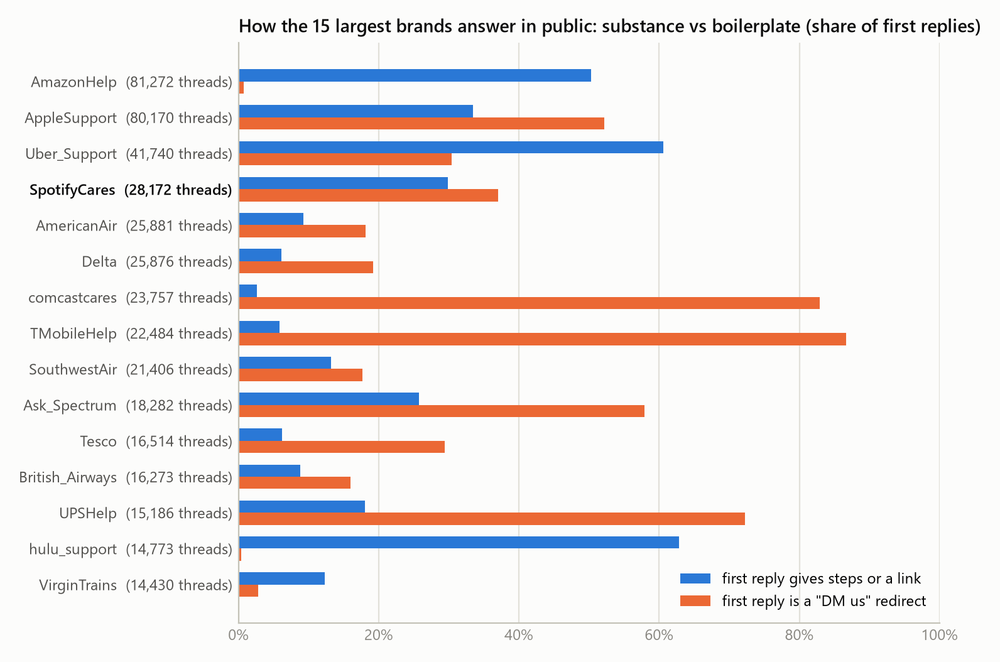

# An AI support agent for SpotifyCares: what it does, how well, and why the headline number is not the whole story

*Hiver SDE Intern take-home — report (≤ 6 pages). Source of truth is this file; `report/report.docx` is rendered from it. Code: github.com/Devesh-Ingale/hiver-support-agent.*

## 1. Problem framing: what "good" means for SpotifyCares

SpotifyCares answers customers in public, one tweet at a time, and the first reply is a triage decision: give a troubleshooting step, ask the one clarifying question that unblocks the case, or move the person to DM because the fix needs their account. A *good* first public reply therefore (a) engages with the specific problem, (b) says only things the brand has actually said in comparable cases, (c) is short and concrete — one next step, ≤280 characters, no handles or agent initials — and (d) never asks for sensitive data in public or promises refunds, fixes or dates. The *good decision* is to auto-send such a reply when history contains the answer and to escalate whenever the account, money, law/safety or an explicit request for a human is involved.

That framing was written down as a policy (`taxonomy.yaml`) **before** any label or model output existed, and it drives three things at once: the human labels, the deterministic rules the agent obeys, and the judge's rubric. It also fixed the acceptance gate the system must clear to be "good enough to trust" (§9): hard-category escalation recall ≥ 0.95 (lower 95 % CI ≥ 0.85), zero validity violations on auto-sent drafts, judge pass-rate ≥ 70 % on auto-handled drafts, expected cost below always-escalating, and a stated automation rate at ≤ 2 % missed hard escalations.

### What I chose not to build

Multi-turn handling (the agent sees only the first customer tweet), DMs and account look-ups, actually sending replies, fine-tuning, sentence-embedding retrieval, other brands, Banking77 (77 banking intents do not transfer to a music app's Twitter traffic), and any UI. Each is either out of scope for a first-reply triage system or would have consumed the time the proof needed.

## 2. Data and brand selection

The Kaggle *Customer Support on Twitter* dump (2.81 M tweets, Oct–Dec 2017) was rebuilt into 798 k threads by following `in_response_to_tweet_id`; 149 tweets sit in reply cycles and were left at their current ancestor. Every customer-rooted thread in the dump has a brand reply — the dump was collected *from* brand accounts — so "the brand replied" is a property of the data, not a finding, and the golden set inherits that selection.

Two dataset quirks mattered. The dump anonymises every non-support handle as `@<number>`, **including the brand's own marketing account**: 45 % of SpotifyCares' inbound tweets address `@115888`, which is @Spotify, not another customer. Ids mentioned in ≥ 10 % of a brand's roots are therefore treated as brand aliases. And agents sign public replies with initials (`/JR`), a convention that a small model copies verbatim unless it is stripped from the evidence (§7).

The brand was chosen from a profile of the 15 largest accounts (Fig. 1): enough history, a real mix of public help and private hand-offs (so the auto/escalate boundary can be learned from the brand, not only from my policy), and a product narrow enough for ≤ 10 intents. SpotifyCares: 28.2 k customer threads (20.9 k before the cutoff, 6.4 k in the 14-day golden window), 40 % of threads receive substantive help, brand turns are 8.5 % steps / 25 % links / 31 % DM-redirects / 18 % clarifying questions, 92 % English. AppleSupport has more data but 53 % of its turns are the same "let's take this to DM" template; hulu_support is the most substantive but small and almost never hands off, so escalation labels would rest on my policy alone.



*Fig. 1 — Substance vs boilerplate in the first public reply, 15 largest brands.*

**Split.** Everything the system may learn from (retrieval corpus, taxonomy induction) is strictly before 2017-11-17; golden candidates come from the following 14 days, with a 2-day buffer before the dump's tail where threads are truncated. No golden thread is in the index (asserted, not assumed).

## 3. Intent taxonomy and escalation policy

Ten intents were written by hand from 20 TF-IDF clusters over 3,000 pre-cutoff tweets (a local-model proposal was used as a cross-check and was too granular): `playback_or_app_issue`, `library_or_playlist_problem`, `account_access_security`, `account_settings_change`, `payment_billing_subscription`, `family_or_student_plan`, `content_request_or_availability`, `feature_request_or_feedback`, `support_followup_or_complaint`, `other_unclear`. Each carries a definition, examples and tie-breaker rules (security beats billing; "greyed out" is playback, "not on Spotify" is availability; praise for staff is a support follow-up, praise for the product is feedback).

Escalation reasons are tiered. **Hard** (always): `account_or_pii`, `payment_refund`, `legal_safety_threat`, `explicit_human_request` — each backed by regexes that fire on 16 % of golden candidates. **Soft**: `anger_churn`. **Routing**: `non_english`, `no_actionable_content`, `no_relevant_resolution`, `draft_invalid`. The taxonomy was frozen as v1 after a 30-item labelling pilot (merges and clarifications only) and committed; the hash is quoted in §5.

## 4. System

One structured call per tweet, wrapped in deterministic code (Fig. 2). TF-IDF retrieval (word 1–2-grams + character 3–5-grams, cosine) returns the five most similar historical customer messages with everything the brand said in reply, down-weighting threads where the brand never gave a step or a link. A local **Qwen3-4B-Instruct** (Ollama, JSON-schema-constrained output, temperature 0) returns intent, secondary intent, confidence, the evidence ids it relied on, a draft reply, a reason and a decision. A post-processor then applies the policy: hard-rule regexes on the customer's text, language and empty-content routing, a "no relevant resolution" similarity floor tuned on the dev set, and tweet-validity checks (≤ 280 chars, no URL absent from the evidence, no `@handles`, no agent initials, no refund/timeline promises, no public request for sensitive data). The model can only be made *more* cautious by this layer; an invalid draft is never sent. Self-reported confidence gates nothing.

```
tweet → TF-IDF retrieval (k=5, boilerplate down-weighted) → one JSON call (local 4B model)
      → policy layer: hard rules · routing · similarity floor · validity checks → record (model answer + final answer)
```
*Fig. 2 — The pipeline. Every run row keeps both the model's answer and the policy-applied one, so all numbers are recomputable offline.*

Systems compared on the same 200 test items: **trivial** (majority intent, template reply, always-escalate and always-auto variants), **simple** (TF-IDF + logistic-regression intents by stratified 5-fold cross-validation with dev labels in every training fold; the brand's real reply to the nearest historical message, verbatim; the policy's keyword rules), **no_rag** (same prompt, no evidence), **main**, **main_gemini** (identical prompts on `gemini-3.8-flash`), and **human_ref** (the brand's actual first replies, judged with the same rubric).

## 5. Evaluation design

**Golden set.** 200 test items = Part A (120, uniform random from the eligible pool; small quotas of 6 near-empty and 6 non-English tweets so routing is exercised) + Part B (80, two per topic cluster plus an oversample of escalation-keyword tweets) — headline numbers use Part A, per-intent and escalation-recall tables use A+B and say so. A disjoint 50-item dev set is the only place prompts and thresholds were tuned; every dev round is logged. Sampling and every exclusion are recorded in `data/golden/sampling_note.md`. Labels: primary and optional secondary intent, escalate + reason code, anger 0–2, labeller confidence 1–3, quality flags, timing — all by the author, blind (no model output, cluster id or brand reply visible), in random order. 40 items were re-labelled blind on a later day; the resulting self-agreement is a *ceiling* inflated by the labeller also being the taxonomy's author. Taxonomy/policy commit: `{TAXONOMY_COMMIT}`.

**Metrics.** Intent accuracy (headline) and macro-F1 with per-class support, strict and lenient (secondary counts). Escalation precision/recall/F1, **hard-category recall**, recall excluding trivially detectable classes, reason-code agreement, a cost view (missed hard = 10, missed soft = 3, unnecessary = 1 per item; sensitivity from 1× to 20×) and the automation rate at ≤ 2 % missed hard escalations, obtained by sweeping the similarity floor offline. Validity-violation rates of raw drafts. Bootstrap 95 % intervals on everything; paired bootstrap and McNemar for main vs each baseline; differences inside the interval are not claims. Run-to-run variance from a second seed on 50 items.

**Judge.** `gemini-3.8-flash` — a different model family from the generator, which removes self-preference by construction — sees the tweet, the same five historical cases for every system, the policy summary and the draft, never the label or the system name. It returns a rationale first, then five binary checks (unsupported content, addresses the problem, unsafe/over-promising, tweet-valid, decision-reason consistent), an overall 1–5 and **sendable** ("a brand agent would send this with at most a light edit"). Pairwise: main vs the verbatim-retrieval baseline in *both* orders; a verdict that flips with position counts as the judge's own noise. Judge validity is probed three ways: 12 synthetic good/bad replies (fabricated URL, public password request, promise, wrong product, off-topic, over-length), a perturbation test that injects one confident fabricated step into 20 good drafts, and a paraphrased-prompt re-judge of 50 items.

**Human agreement.** Before seeing any judge output, the author rated 80 blinded pairs (main vs simple, random A/B) and 40 blinded absolute replies stratified across four systems with the judge's own rubric. Reported: pairwise agreement and κ, sendable κ with CI, Spearman and weighted κ on the 1–5 score, agreement per system, and the disagreements themselves. The judge was **not** tuned against these ratings.

## 6. Results

TODO — headline table (tables.md), Part A vs A+B, cost curve (Fig. 3), operating curve (Fig. 4), judge pass rates incl. human reference (Fig. 5), pairwise (Fig. 6), human-vs-judge cross-tab (Fig. 7), ablation and stronger-model row, variance.

## 7. Failure analysis: top 5 failure modes

TODO — real examples, frequency, hypothesis for each. Candidates seen on dev already: agent-initial copying (fixed in dev round 1), low retrieval similarity for novel issues, over-escalation without evidence.

## 8. What is misleading about my headline number?

TODO — every point quantified: brand selection bias; single-author labels/policy/rubric; N and interval widths; 2-week 2017 slice with dedup and oversampling; "grounded" ≠ correct (no outcomes, dead links); judge κ and self-consistency; escalation recall from trivial classes; test-set touch count; first-tweet only; recurring vs novel gap; run variance; verbatim baseline inside the CI where true; filtering vs real inbound junk.

## 9. Verdict against the acceptance gate

TODO.

## 10. What I would do with one more week

TODO.
